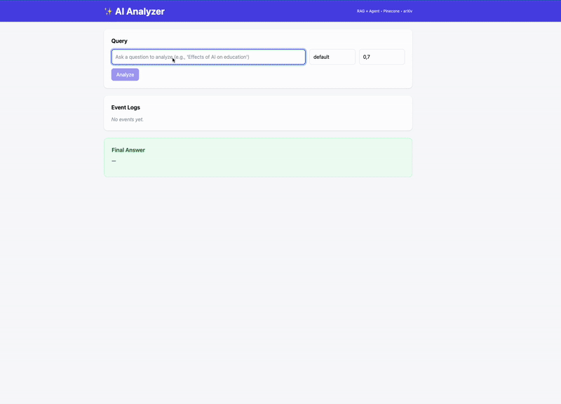

# Analyzer: My AI Agentic Flow Learning Project

A personal experiment in building AI agents that can analyze documents, answer questions, and demonstrate different approaches to agentic workflows. Threat this as a playground for exploring LangChain, RAG systems, and multi-agent architectures.



## What is This?

This is my personal learning project where I experiment with building AI agents that can:
- Read and process scientific PDF documents
- Use different tools (scout, reader, processor) to gather information
- Implement RAG (Retrieval-Augmented Generation) workflows
- Handle streaming responses and real-time agent decision making
- Process and analyze document content

It's definitely not production-ready - more like a sandbox where I try out different AI agent patterns and see what works!

**Frontend**: Check out the [Analyzer Frontend](https://github.com/SeyranPH/Analyzer-frontend) for the complete user interface!

## What I'm Exploring

* **🤖 AI Agent Patterns**: Building agents that can decide which tools to use
* **🔍 RAG Implementation**: Playing with retrieval-augmented generation
* **📚 Multi-Tool Workflows**: Agents that can scout, read, and process documents
* **⚡ Streaming Responses**: Real-time feedback on what the agent is thinking
* **🛠️ LangChain Integration**: Learning the ins and outs of the framework
* **🌐 Vector Search**: Experimenting with Pinecone for document retrieval

## How It Currently Works (More or Less)

1. **Upload a PDF** - My agents try to read and extract text
2. **Ask Questions** - The system attempts to find relevant context
3. **Agent Decisions** - Watch as agents decide which tools to use
4. **Streaming Output** - See the thought process in real-time

## Tech Stack

* **Python**
* **FastAPI**
* **LangChain**
* **OpenAI**
* **Pinecone**


## API Endpoints

- `POST /analysis/arxiv-query` - Query arxiv for relevant scientific papers
- `POST /analysis/pdf` - Read a PDF from arxiv
- `POST /analysis/processor` - Process some text (designed for arxiv papers)
- `POST /analysis/answer` - Query a topic for AI Agent analysis

## Getting It Running (If You're Curious)

### Prerequisites
* Python 3.9+
* Poetry
* OpenAI API key
* Pinecone API key

### Setup
```bash
poetry install
poetry run uvicorn main:app --reload
```

## What I'm Still Figuring Out

- Better error handling
- More sophisticated agent decision making
- Performance optimization

## About
🔍 **Analyzer** - My personal playground for exploring AI agentic workflows, RAG systems, and the weird world of AI agents. Built for learning, not for production. Expect bugs, expect weird behavior, expect to learn something! 🚀
